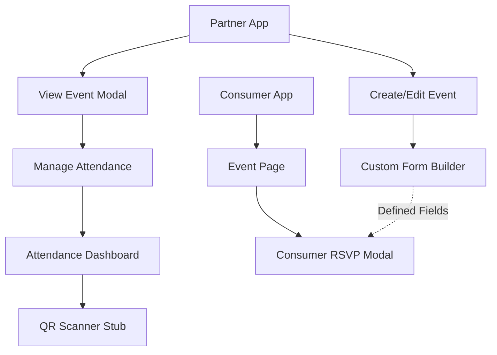

# Walkthrough: Modular Event Feature System

This walkthrough guides you through testing the new modular features implemented for the Event Engine.

## Testing Paths

Assuming your local development server is running at `http://localhost:9003`:

### 1. Custom Form Builder (Host/Partner View)
**URL**: [http://localhost:9003/events](http://localhost:9003/events)

1.  Click the **"Create Event"** button (or edit an existing one).
2.  Scroll down to the **"📋 Event Features"** section.
3.  Enable **"Enable RSVP & Attendance Tracking"**.
4.  You will see the **"Custom RSVP Questions"** builder.
5.  Click **"Add Custom Field"** to add up to 10 questions.
6.  Try adding different types: **Short Text**, **Dropdown**, and **Checkbox**.

---

### 2. QR Scanner Stub (On-site Management)
**URL**: [http://localhost:9003/events](http://localhost:9003/events)

1.  From the events list, click on any event to open the **"View Event"** modal.
2.  Click the teal **"Manage Attendance"** button.
3.  In the Attendance Dashboard, click the **"📷 QR Scan"** button in the filter bar.
4.  Interact with the simulated scanner:
    -   Click **"Start Camera"** (simulated).
    -   Watch the scanning animation.
    -   Verify the success state and scanned code display.

---

### 3. Consumer RSVP Modal (Guest-side Scaffold)
> [!NOTE]
> The `ConsumerRSVPModal` is a reusable component ready for integration into your public-facing event pages. 

To see it in action during development, you can temporarily trigger it from a test button in `EventsDashboard.tsx` or wait for us to integrate it into the public Event Detail page.

## Key Files Created/Modified
- [CustomFormBuilder.tsx](file:///Users/admin/Dropbox/Development/localplus-partner/src/components/CustomFormBuilder.tsx)
- [ConsumerRSVPModal.tsx](file:///Users/admin/Dropbox/Development/localplus-partner/src/components/ConsumerRSVPModal.tsx)
- [QRScannerStub.tsx](file:///Users/admin/Dropbox/Development/localplus-partner/src/components/QRScannerStub.tsx)

